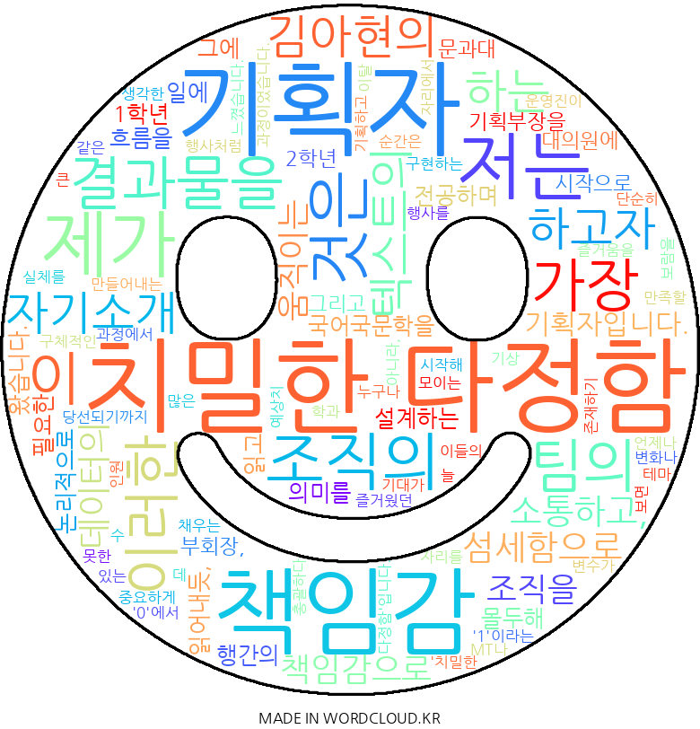

# meahyeon
김아현의 자기소개

제가 하고자 하는 것은 텍스트의 섬세함으로 소통하고, 데이터의 책임감으로 조직을
움직이는 기획자입니다.

국어국문학을 전공하며 행간의 의미를 읽어내듯, 저는 조직의 흐름을 읽고 그에 필요한 결과물을 논리적으로 설계하는 일에 몰두해 왔습니다. 
1학년 기획부장을 시작으로 2학년 부회장, 그리고 문과대 대의원에 당선되기까지 제가 가장 즐거웠던 순간은 언제나 '0'에서 시작해 '1'이라는 실체를 만들어내는 과정이었습니다.
단순히 자리를 채우는 운영진이 아니라, 학과 MT나 테마 행사처럼 많은 이들의 기대가 모이는 자리에서 누구나 만족할 수 있는 구체적인 즐거움을 기획하고 구현하는 데 큰 보람을 느꼈습니다.

이 과정에서 제가 가장 중요하게 생각한 것은 '치밀한 다정함'입니다. 행사를 총괄하다 보면 예상치 못한 기상 변화나 인원 이탈 같은 변수가 늘 존재하기 마련입니다.
저는 이를 운에 맡기지 않고, 발생 가능한 상황들을 미리 시나리오로 그려보며 대비책을 세웠습니다. 
이러한 준비성은 갑작스러운 돌발 상황에서도 팀원들을 안심시켰고, 결국 프로젝트를 안전하게 완주해내는 원동력이 되었습니다. 
나 한 사람의 꼼꼼함이 조직 전체의 안정감으로 이어진다는 것을 깨달은 소중한 경험이었습니다.

이 경험은 기획자의 책임감을 일깨워주었습니다. 정교한 기획이 팀의 신뢰 자본이 됨을 배웠기에, 현장의 목소리를 분석해 사람 중심의 결과물을 만드는 과정을 즐깁니다. 이제 저는 이러한 역량을 바탕으로 더 넓은 세상에서 또 다른 ‘1’을 만들어보고 싶습니다. 팀의 보폭에 맞춘 ‘치밀한 다정함’으로 동료에게 신뢰를 주며, 모든 변수를 상수로 바꾸는 조직의 에너지가 되겠습니다.
 

